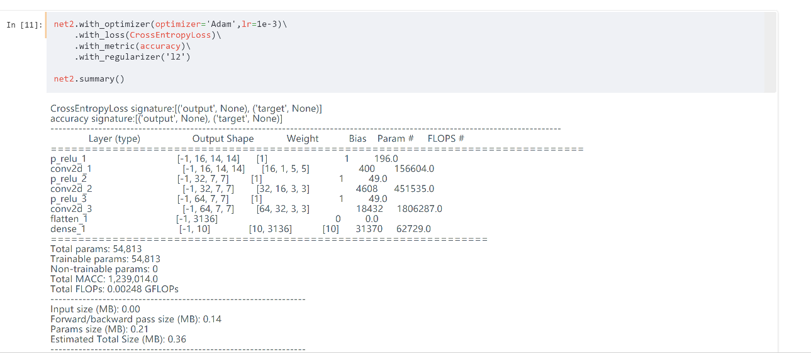

# 如何建構圖像識別模型AB Test

## 場景

幾乎所有深度學習的hello world就是mnist手寫數據集，我們在這也不例外，我們將會透過這個案例的實作來讓大家理解trident的主要特性與使用邏輯。

## 需求

基於mnist手寫數據集，建構一個識別10個數字的分類模型。但是我們想要知道到底使用傳統的relu活化函數，還是使用參數化relu (parametered relu)哪個效果好一點。這時候我們會需要一個AB Test來協助我們比較兩者的效果。

## 代碼

```python
import os
os.environ['TRIDENT_BACKEND'] = 'pytorch'
import trident as T
from trident import *

data_provider = T.load_mnist('mnist')  
data_provider.image_transform_funcs = [add_noise(0.1),normalize(127.5, 127.5)]  

def convnet(activation='relu'):
    return Sequential(
        Conv2d((5,5),16,strides=2,auto_pad=True,activation=activation),
        Conv2d((3, 3),32, strides=2, auto_pad=True,activation=activation),
        Conv2d((3, 3), 64, strides=1, auto_pad=True,activation=activation),
        Flatten(),
        Dense(10)
    )

net1=Model(input_shape=(1,28,28),output=convnet('relu'))
net2=Model(input_shape=(1,28,28),output=convnet('p_relu'))
net1.summary()
net2.summary()


net1.with_optimizer(optimizer='Adam',lr=1e-3) \
    .with_loss(CrossEntropyLoss)\
    .with_metric(accuracy)\
    .with_regularizer('l2')\


net2.with_optimizer(optimizer='Adam',lr=1e-3)\
    .with_loss(CrossEntropyLoss)\
    .with_metric(accuracy)\
    .with_regularizer('l2')


plan=TrainingPlan()\
    .add_training_item(net1,name='net1')\
    .add_training_item(net2,name='net2')\
    .with_data_loader(data_provider)\
    .repeat_epochs(10)\
    .within_minibatch_size(64)\
    .print_progress_scheduling(10,unit='batch')\
    .display_loss_metric_curve_scheduling(100,unit='batch',imshow=True)

plan.start_now()
```


## 成果

```python
import os
os.environ['TRIDENT_BACKEND'] = 'pytorch'
import trident as T
from trident import *
```

```python

data_provider = T.load_mnist('mnist')  
data_provider.image_transform_funcs = [add_noise(0.1),normalize(127.5, 127.5)]  
```


```python
def convnet(activation='relu'):
    return Sequential(
        Conv2d((5,5),16,strides=2,auto_pad=True,activation=activation),
        Conv2d((3, 3),32, strides=2, auto_pad=True,activation=activation),
        Conv2d((3, 3), 64, strides=1, auto_pad=True,activation=activation),
        Flatten(),
        Dense(10)
    )

net1=Model(input_shape=(1,28,28),output=convnet('relu'))
net2=Model(input_shape=(1,28,28),output=convnet('p_relu'))
net1.summary()
net2.summary()
```



```

net1.with_optimizer(optimizer='Adam',lr=1e-3) \
    .with_loss(CrossEntropyLoss)\
    .with_metric(accuracy)\
    .with_regularizer('l2')\
```


```python

plan=TrainingPlan()\
    .add_training_item(net1,name='net1')\
    .add_training_item(net2,name='net2')\
    .with_data_loader(data_provider)\
    .repeat_epochs(10)\
    .within_minibatch_size(64)\
    .print_progress_scheduling(10,unit='batch')\
    .display_loss_metric_curve_scheduling(100,unit='batch',imshow=True)

plan.start_now()
```


